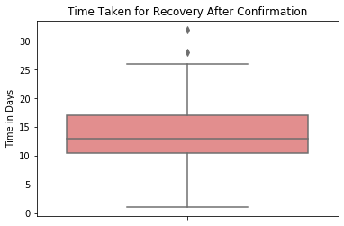
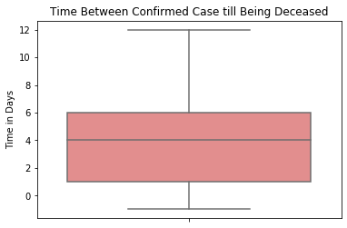

# COVID19 Challenge
A data challenge held by the [@DataCommunitySA](https://twitter.com/DataCommunitySA) on March 15th, 2020 to submit a report that utilizes open sourced data of COVID19 and shows valuable extracted information regarding the virus
#### Among 150+ participants, I was palced the 3rd in a pool of 4 selected winners >>  [Congratulation tweet in Arabic](https://twitter.com/DataCommunitySA/status/1249400618676076552?s=20)

## Main Report Content -- How Does It Fly?
### Time Cycle of the Virus
  

### Contagiuosness Degree
* The minimum number of people infected by an COVID patient = 1
* The maximum number of people infected by an COVID patient = 44
* The average number = 2.27 and that almost similar to the reproductive number of the COVID19 

### Spread Factors
* It was assumed that some country-level factors e.g. life expectancy score, epidemics history (ebola, sars, mers-cov), etc. can show a correlation with the current COVID19 number of confirmed cases
* There was no strong correlation, but a potential correlation
* For example, life expectancy and population density showed an increasing pattern with the Log number of COVID19 confirmed cases

 

* while population age ratio for ages less than 14 showed a negative pattern

